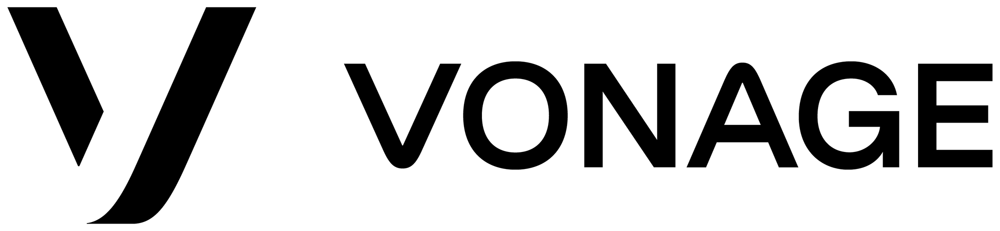

# Build a Thing with Kevin Lewis - Serverless Video Conferencing 

Join Kevin Lewis, Developer Advocate at Vonage, as he builds a new project from scratch over several weeks in his new show on [Twitch](https://www.twitch.tv/vonagedevs). Kevin is currently building a serverless video conferencing application using Netlify Functions and MongoDB.

You can join in at any point and follow along with this repo, using branches to find the right week. 

## Code of Conduct

In the interest of fostering an open and welcoming environment, we strive to make participation in our project and our community a harassment-free experience for everyone. Please check out our [Code of Conduct](.github/CODE_OF_CONDUCT.md) in full.

## Contributing

We :heart: contributions from everyone! Check out the [Contributing Guidelines](.github/CONTRIBUTING.md) for more information.

## License

This project is subject to the [MIT License](LICENSE)
